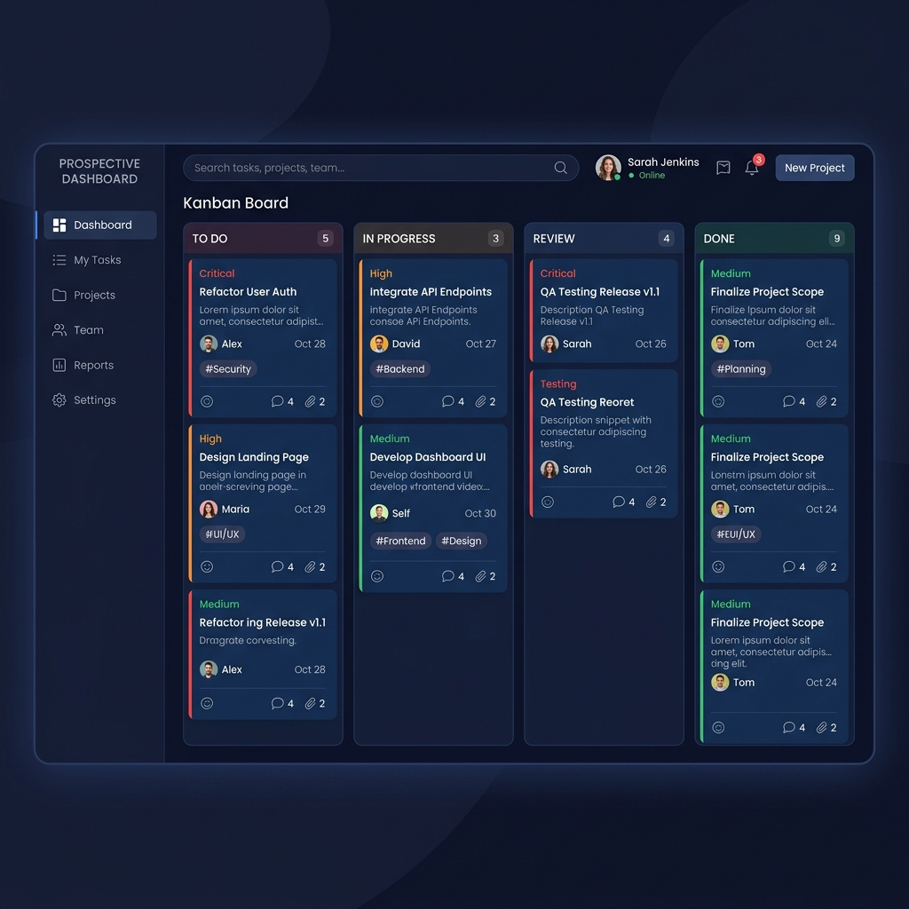

# 🎯 Task Board — Kanban en Vanilla JavaScript

Bienvenue dans le projet **Task Board**, une application web complète de gestion des tâches de type Kanban, conçue de manière modulaire en **JavaScript Vanilla** (JS pur). Aucun framework ni bibliothèque tierce n'est utilisé.

Cette application offre une interface moderne, fluide, et réactive en design sombre, permettant d'organiser vos tâches quotidiennes selon leur priorité et leur avancement.

---

## 📸 Capture d'Écran de l'Interface

Voici un aperçu du design moderne et sombre de l'application :



*(Note : L'illustration est disponible sous le nom `screenshot.png` à la racine du projet).*

---

## 📂 Structure des Fichiers et Rôles

Le projet est organisé selon une structure modulaire stricte, respectant la séparation des responsabilités :

```text
task-board/
├── index.html         # Structure HTML5 sémantique de l'application
├── screenshot.png     # Capture d'écran illustrative du design
├── README.md          # Guide explicatif du projet (ce fichier)
├── css/
│   └── style.css      # Feuille de style CSS moderne, sombre et responsive
└── js/
    ├── main.js        # Point d'entrée, gestion du cycle de vie et coordination
    ├── dom.js         # Création dynamique des cartes, manipulation du DOM et filtres
    ├── storage.js     # Gestion de la persistance (localStorage & sessionStorage)
    └── api.js         # Service AJAX (requêtes asynchrones avec fetch et try/catch)
```

### Rôle détaillé de chaque script :
*   **`main.js`** : Initialise l'application au chargement de la page (`DOMContentLoaded`). Il orchestre le flux de données en combinant l'API, le stockage et l'affichage DOM. Il définit également les écouteurs globaux et implémente la **délégation d'événements** pour les clics sur les boutons des cartes dynamiques.
*   **`dom.js`** : Ce module contient tout le code en lien avec le DOM. Il crée des éléments HTML complexes avec `document.createElement()`, gère l'affichage en temps réel du Kanban, filtre les cartes lors de la saisie utilisateur et effectue les validations de formulaire.
*   **`storage.js`** : Fournit une interface pour enregistrer et charger l'état du tableau dans le `localStorage` (sauvegarde de la liste complète des tâches) et comptabiliser les actions réalisées dans la session via le `sessionStorage`.
*   **`api.js`** : Contient le code AJAX pour interroger l'API externe JSONPlaceholder. Il récupère 6 todos d'exemple et les retourne formatés, en interceptant de manière rigoureuse les pannes réseau.

---

## ⚡ Les 4 Compétences Frontend Couvertes

Le projet démontre la maîtrise de quatre compétences fondamentales en développement Frontend moderne :

### 1. Manipulation Avancée du DOM
*   **Création dynamique** : Les cartes de tâches ne sont pas injectées via un simple `innerHTML` qui pourrait poser des failles XSS, mais sont créées à l'aide de `document.createElement()`. Chaque nœud (titre, paragraphe de description, boutons) est créé, configuré (classes, attributs `data-*`), puis assemblé.
*   **Indicateurs dynamiques** : Le nombre de tâches dans chaque colonne ("À faire", "En cours", "Terminé") est recalculé et mis à jour automatiquement à chaque ajout, déplacement ou suppression.

### 2. Gestion des Événements JavaScript
*   **Écouteurs standard** : Écoute de l'événement `submit` sur le formulaire pour l'ajout, avec prévention du comportement par défaut (`event.preventDefault()`) et validation personnalisée des champs.
*   **Délégation d'événements** : Au lieu d'ajouter des écouteurs individuels sur chaque bouton de déplacement ou de suppression lors de la création d'une carte (ce qui nuirait aux performances et complexifierait le code), un écouteur unique est configuré sur le conteneur parent `.kanban-board`. Les clics sont interceptés et distribués grâce aux attributs HTML5 `data-action`.
*   **Recherche en temps réel** : Utilisation de l'événement `input` sur le champ de recherche, déclenchant instantanément un filtre insensible à la casse sur les titres et descriptions des cartes sans nécessiter de rechargement.

### 3. Requêtes AJAX avec `fetch()`
*   **Appel asynchrone** : Lors du tout premier chargement de l'application (quand le `localStorage` est vide), l'application exécute une requête HTTP `GET` vers l'API `https://jsonplaceholder.typicode.com/todos?_limit=6`.
*   **Gestion des erreurs robuste** : Le bloc `try / catch` intercepte les échecs de connexion ou les codes de statut HTTP incorrects. Au lieu d'afficher une boîte d'alerte (`alert()`) invasive, l'erreur est interceptée et injectée dans le DOM sous forme de bandeau d'alerte rouge et élégant en haut du board.

### 4. Utilisation du Web Storage
*   **Persistance locale (localStorage)** : L'ensemble du tableau Kanban est sauvegardé sous forme sérialisée (JSON stringifié) après chaque modification (création, transition ou suppression). Au rechargement de la page, l'application restaure instantanément l'état exact du board.
*   **Données de session (sessionStorage)** : Suivi en temps réel des actions de l'utilisateur (nombre d'ajouts, de déplacements et de suppressions effectués durant la session courante) affiché fièrement dans le pied de page de l'application.
*   **Bouton de Réinitialisation** : Permet de purger les données persistantes locales et de forcer un nouvel appel vers l'API externe pour rétablir les données d'exemples.

---

## 🎨 Design Sombre Premium et Responsive

L'esthétique de l'interface a été extrêmement travaillée pour proposer un rendu haut de gamme :
*   **Palette de couleurs** : Fond sombre profond (`#1a1a2e`), colonnes en bleu marine minuit (`#16213e`), et cartes foncées (`#0f3460`) pour un contraste reposant.
*   **Bordures de priorité** : Une bande colorée distinctive sur le flanc gauche des cartes indique immédiatement la priorité (Haute = Rouge, Moyenne = Orange, Basse = Vert).
*   **Mise en page fluide** : Colonnes alignées en `Flexbox` qui se replient automatiquement en mode colonne sur les terminaux mobiles (`flex-wrap: wrap`) pour assurer une ergonomie parfaite sur toutes les tailles d'écran.
*   **Micro-interactions et animations** :
    *   Transition douce de translation et d'ombre au survol des cartes (`transform: translateY(-2px)`).
    *   Animation d'entrée fluide lors de la création d'une carte.
    *   Animation de fondu de sortie (`fade-out`) raffinée d'une durée de 250ms avant la suppression physique de la carte du DOM.

---

## 🚀 Comment Lancer le Projet ?

Étant donné que l'application est écrite en JavaScript pur sans build complexe :

1.  **Méthode recommandée (avec serveur de développement)** :
    *   Si vous utilisez un éditeur de code tel que VS Code, faites un clic droit sur le fichier `index.html` et choisissez **Open with Live Server**.
    *   *Pourquoi ?* Les modules JS et l'intégration asynchrone fonctionnent de manière optimale lorsqu'ils sont servis à travers un protocole `http://`.
2.  **Méthode directe (Système de fichiers)** :
    *   Double-cliquez simplement sur le fichier `index.html` dans votre explorateur de fichiers Windows.
    *   L'application est conçue pour contourner les limitations de sécurité CORS relatives au protocole `file://` grâce à notre architecture modulaire robuste, vous garantissant un fonctionnement parfait hors-ligne dès l'ouverture.
